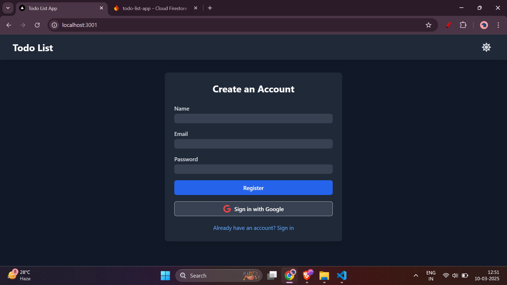
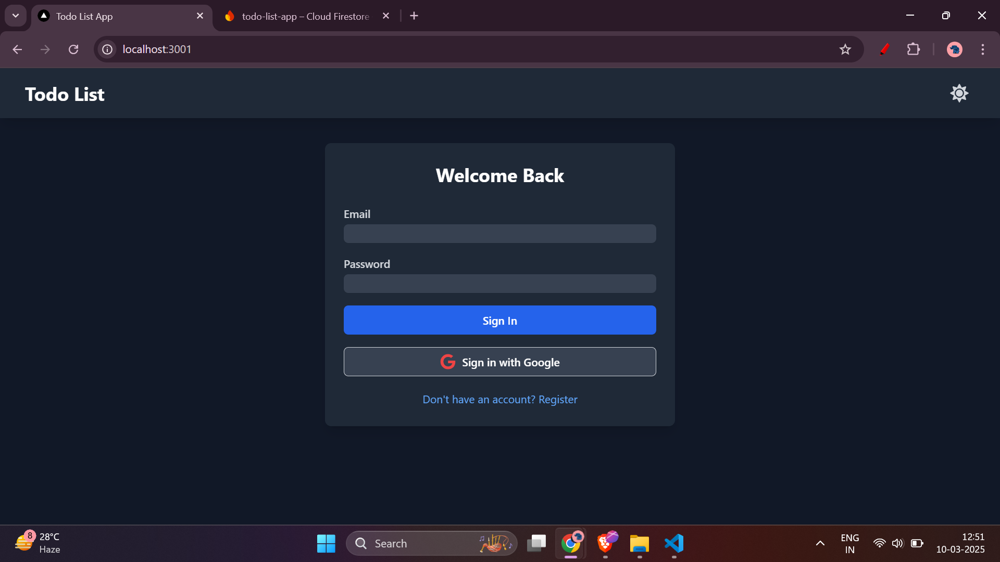
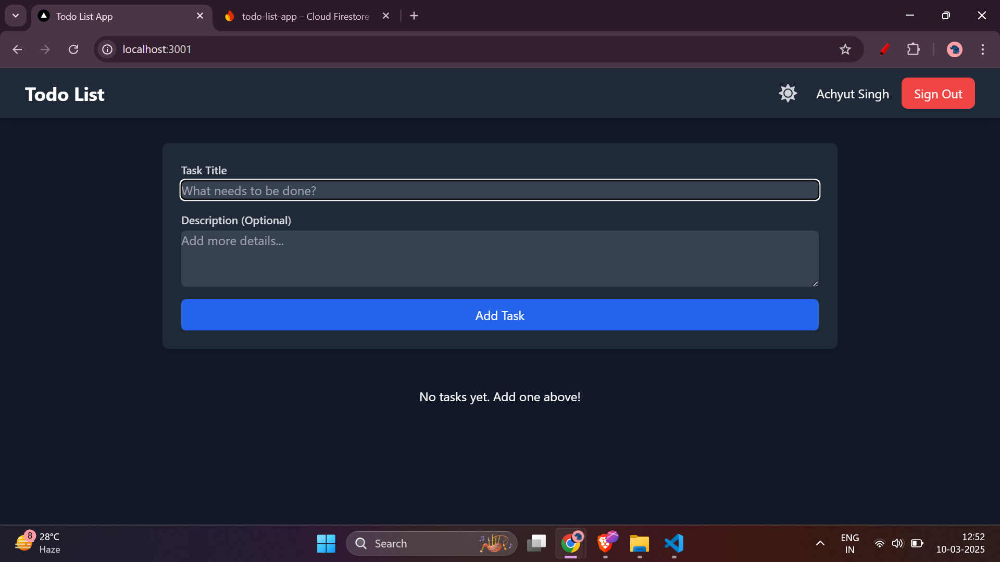
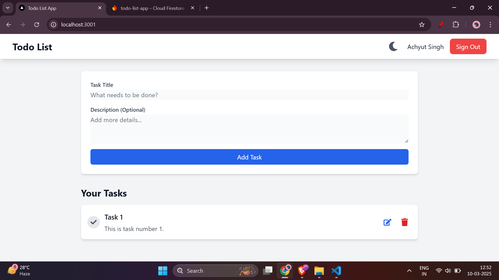
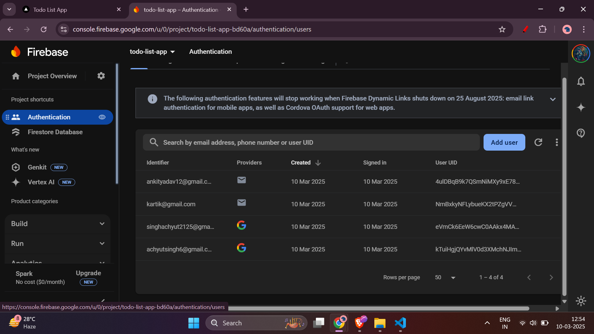
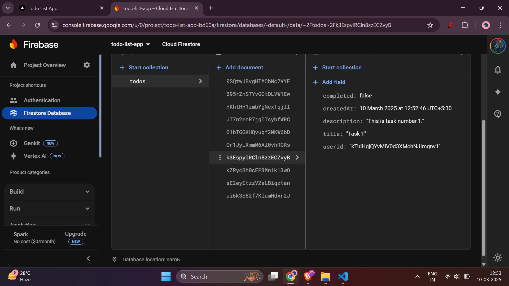

# 📝 React To-Do App with Firebase

A fully responsive To-Do Application built with **ReactJS**, using **Firebase** as the backend and **Redux Toolkit** for state management. The app allows users to add, update, delete, and mark tasks as completed while ensuring a seamless user experience.

Website Link:
https://reactify-todo-list.vercel.app/

## 🚀 Features

### ✅ User Authentication
- Firebase Authentication (Google Sign-In or Email/Password)
- Store user details securely in Firebase Firestore

### ✅ To-Do Management
- Add, edit, delete, and mark tasks as completed
- Tasks stored in Firebase Firestore with real-time updates
- Each task includes:
  - `id` (unique identifier)
  - `title` (task title)
  - `description` (detailed info)
  - `status` (completed/incomplete)
  - `createdAt` (timestamp)
- Only authenticated users can manage their tasks

### ✅ State Management
- Managed efficiently using **Redux Toolkit**
- Authentication and tasks stored in the Redux store

### ✅ UI & Responsiveness
- Clean and responsive UI designed with **Tailwind CSS**
- Optimized for both **mobile** and **desktop** users
- Proper loading states and error handling

### 🌟 Bonus Features 
- Dark Mode toggle


## 🛠 Tech Stack
- **Frontend:** ReactJS
- **State Management:** Redux Toolkit
- **Backend:** Firebase Firestore & Firebase Authentication
- **Styling:** Tailwind CSS (or Styled Components)

## 📂 Project Setup

### 1️⃣ Clone the Repository
```sh
git clone https://github.com/your-username/reactify-todo-list.git
cd reactify-todo-list
```

### 2️⃣ Install Dependencies
```sh
npm install
```

### 3️⃣ Set Up Firebase
1. Create a Firebase project at [Firebase Console](https://console.firebase.google.com/).
2. Enable **Firestore Database** and **Authentication**.
3. Get your Firebase config and create a `.env` file:
```env
REACT_APP_FIREBASE_API_KEY=your-api-key
REACT_APP_FIREBASE_AUTH_DOMAIN=your-auth-domain
REACT_APP_FIREBASE_PROJECT_ID=your-project-id
REACT_APP_FIREBASE_STORAGE_BUCKET=your-storage-bucket
REACT_APP_FIREBASE_MESSAGING_SENDER_ID=your-sender-id
REACT_APP_FIREBASE_APP_ID=your-app-id
```

### 4️⃣ Run the App
```sh
npm run start
```

## 🚀 Deployment
Deploy the app using **Firebase Hosting**, **Vercel**, or **Netlify**:

### Firebase Hosting:
```sh
npm run build
firebase deploy
```

### Vercel:
```sh
vercel
```

### Netlify:
```sh
netlify deploy
```


## 📸 Screenshots 


| Register | Login | To-Do List (Dark Mode) |
|----------|-------|-----------------------|
|  |  |  |

| To-Do List (Light Mode) | Firebase Auth | Firestore |
|-------------------------|--------------|-----------|
|  |  |  |


"# To-do" 
